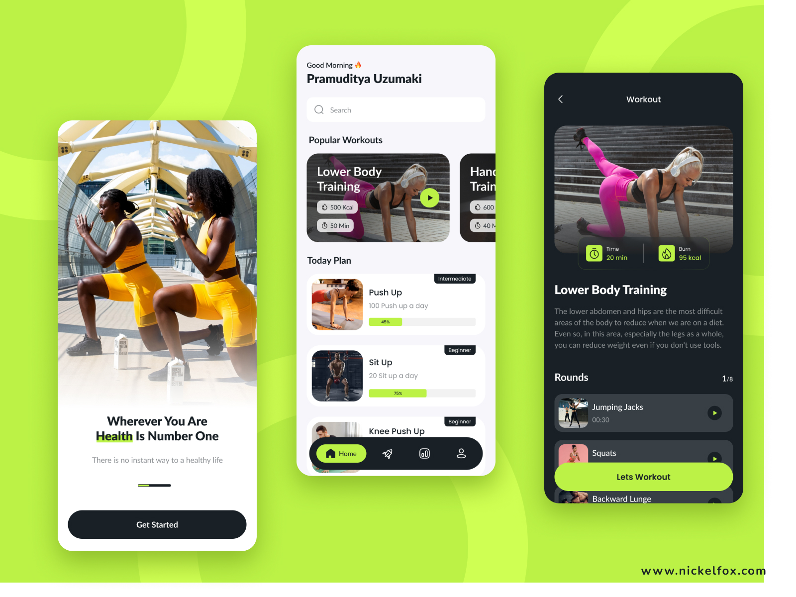

# CampusPlaus - Sports Facility Finder

Welcome to **CampusPlaus**, a simple Flutter app designed to showcase different sports facilities with information on each sport’s features. This app helps users easily browse available sports areas in a clean, user-friendly design.

## Preview



## Features

- **Horizontal Scroll View**: Quickly swipe through different sports facilities, each displayed in a card format.
- **Sport Information**: Each card contains an image, a title, and a brief description of the sport or facility.
- **Dark Overlay on Images**: Added an overlay on each card’s image to enhance text readability.

## Learning Points

Through this project, I learned:

1. **Apply Dark Overlays**: I used a `Container` with a semi-transparent black background to improve the text readability over images.
2. **Stack Widgets**: Learned how to layer widgets like images and text using the `Stack` widget.
3. **Background Images on Containers**: Discovered how to set an image as a container’s background using `DecorationImage` in `BoxDecoration`.
4. **Adjust Text Colors for Readability**: Experimented with using lighter colors for text when displayed over dark background images.

## Setup Instructions

1. Clone the repository:

    ```bash
    git clone <your-repository-url>
    ```

2. Navigate into the project directory:

    ```bash
    cd campusplaus
    ```

3. Install dependencies:

    ```bash
    flutter pub get
    ```

4. Open the project in an emulator or on a physical device:

    ```bash
    flutter run
    ```

## Acknowledgments

- Thanks to Flutter for providing an excellent framework to build mobile applications.
- Special thanks to anyone who has contributed or inspired this project.

Feel free to open an issue or contribute to the project!

---

Make sure your `assets/01.jpg` image is properly added to your `pubspec.yaml` file under the assets section like so:

```yaml
flutter:
  assets:
    - assets/01.jpg
