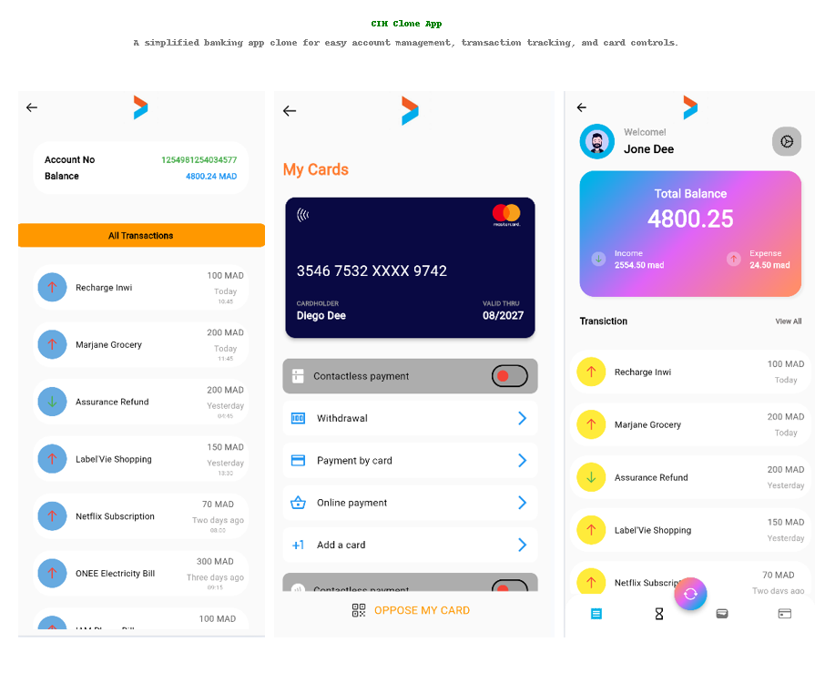

# CIH Clone App

This project is a simplified and modernized clone of the CIH banking app. The goal was to create a clean, user-friendly interface that enhances the overall user experience.

## Purpose
I developed this CIH app clone to explore modern UI design practices and to make the app layout look more streamlined and intuitive.

## Key Learnings
During this project, I gained valuable skills, including:
- Using the `Stack` widget for layered layouts.
- Improved code management for organizing and structuring Flutter code efficiently.

## Preview


## Installation
To install and run the app, you can find the APK in the following path:

```
build/app/outputs/flutter-apk/
```

Feel free to explore the code and provide feedback!
