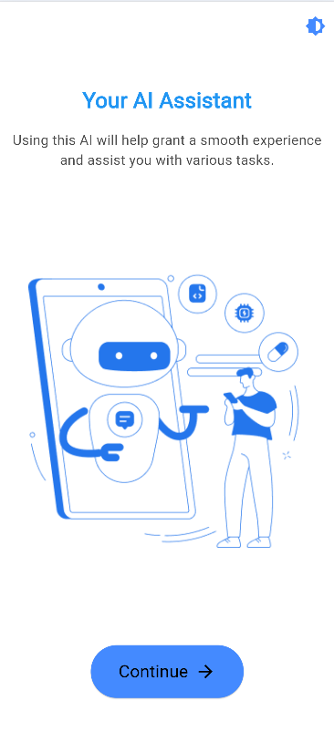
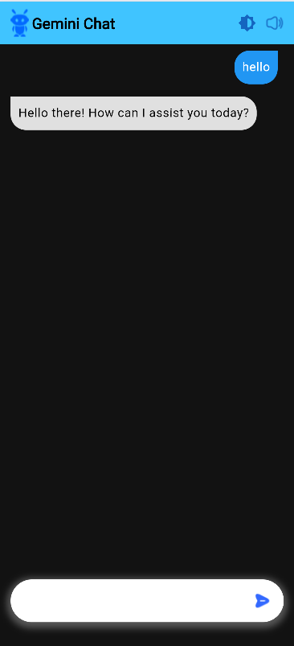

## AI Chat Bot
## Features

- Chat-based AI interaction.
- Customizable to your needs with Gemini's conversational AI.
- Designed with both Dark Mode and Light Mode for an adaptable user experience.

## Screenshots

Here's a preview of the app in both Dark and Light modes. These images demonstrate the clean, modern UI designed to be both functional and visually appealing.

| Light Mode                               | Dark Mode                                |
|------------------------------------------|------------------------------------------|
|           |           |
|           |           |

## Installation

To install and run the app:

1. Clone the repository.
2. Navigate to the `build/app/outputs/flutter-apk/` directory.
3. Install the APK on your device to start using the AI Chat.

## Project Structure

- `lib/`: Contains the main Flutter app code.
- `assets/`: Holds the app assets, including the screenshots.
- `build/app/outputs/flutter-apk/`: Directory with the latest APK build.

## Credits

Developed with Flutter and Gemini API integration. 
---

Feel free to reach out if you have any questions or suggestions. Thank you for checking out this project!
