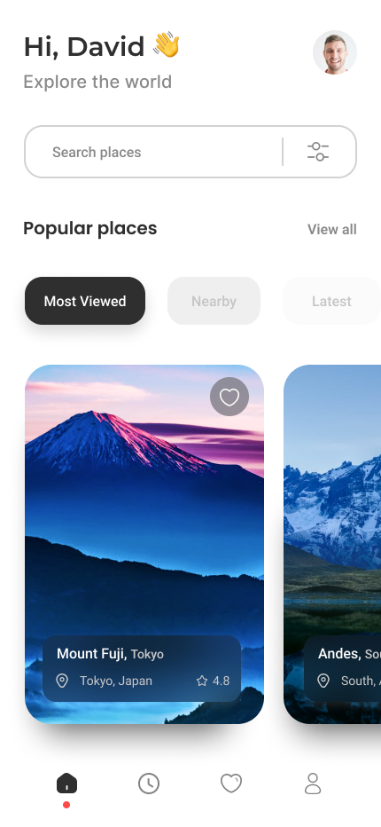
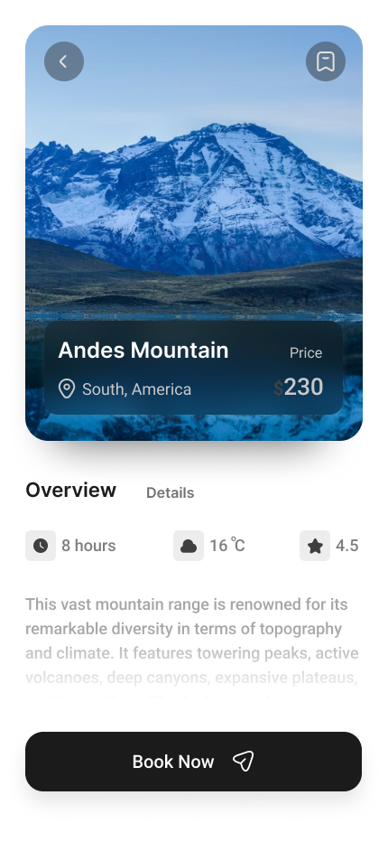

# Random Figma Design

Welcome to the **Random Figma Design** app! This is a simple Flutter application that showcases some design elements inspired by Figma. Flutter is a fantastic framework developed by Google that allows developers to build beautiful natively compiled applications for mobile, web, and desktop from a single codebase.

## Overview

In this app, you'll find three main pages:

1. **Home Page**
2. **Splash Page**
3. **Booking Page**

### What is Flutter?

Flutter is an open-source UI software development toolkit created by Google. It enables developers to create visually attractive and high-performance applications for various platforms using a single codebase. This means you can write your app once and deploy it on both iOS and Android, saving time and effort.

### What is ListView?

ListView is a scrollable list of widgets in Flutter. It’s a powerful and flexible way to display a list of items, allowing you to easily create dynamic and interactive user interfaces. You can customize the list to show a variety of items, such as images, text, or any other widgets. ListView helps improve user experience by making navigation easy and efficient.

## Screenshots

Here are some screenshots of the app:

### Home Page


### Splash Page


### Booking Page


## Getting Started

To get started with this app, follow these steps:

1. **Clone the repository:**
   ```bash
   git clone https://github.com/yourusername/randomfigmadesign.git
